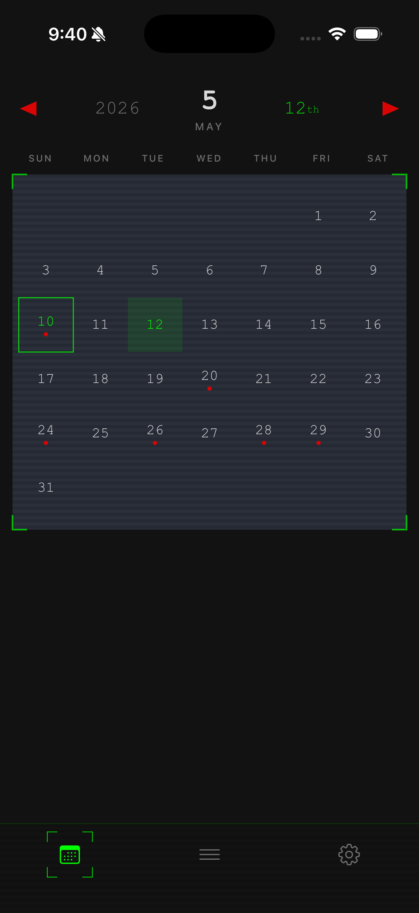
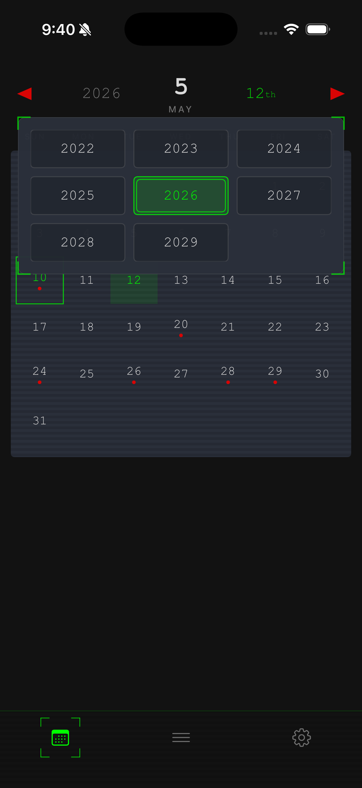
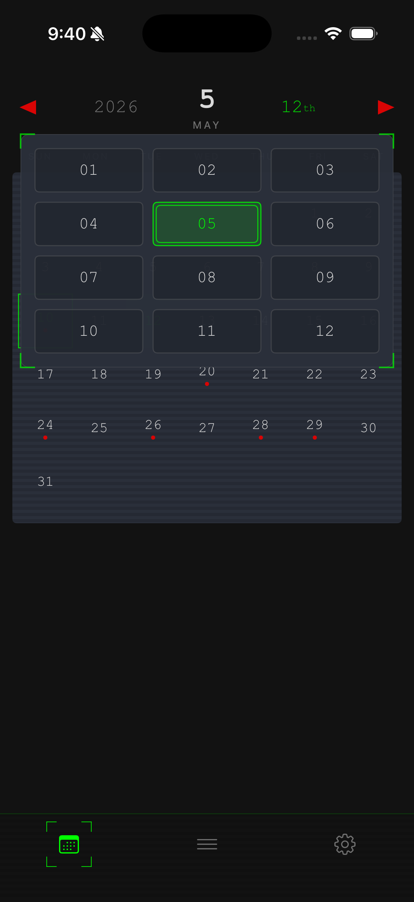
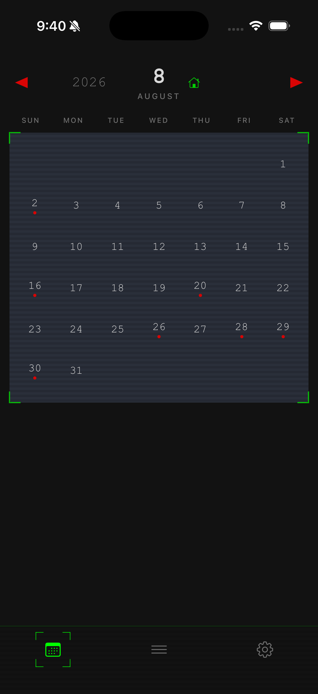
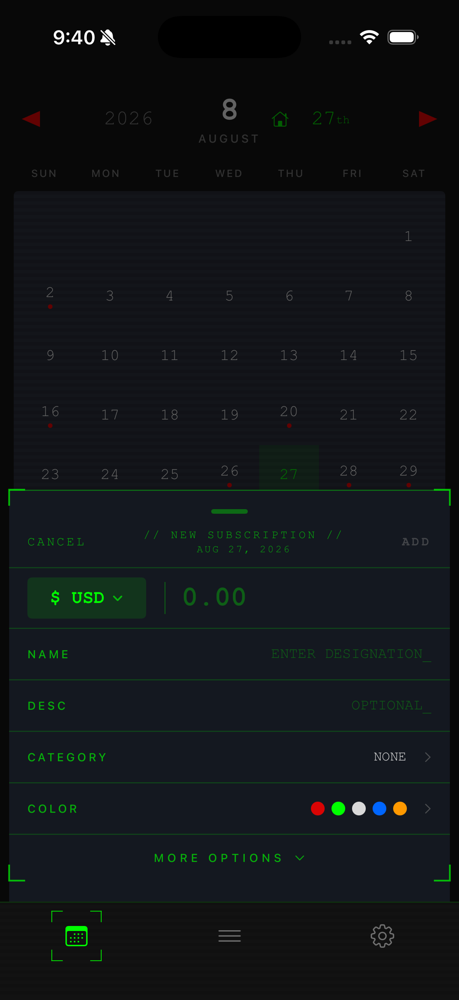
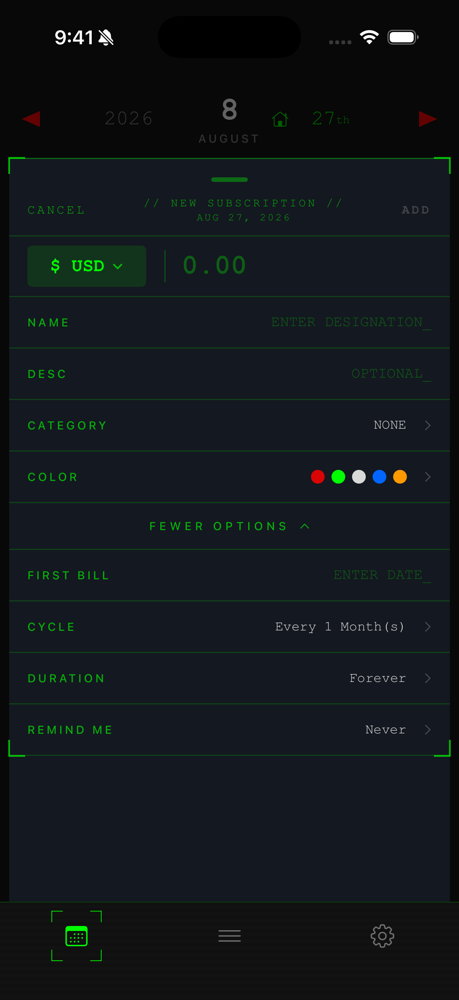
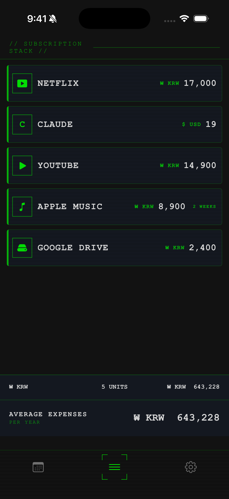

# rachael-ios
Rachael, your subscription manager for iOS.
 
 
 
## Actively updated weekly.

### progress notes May 10th, 2026.
Just built the first and second tab roughly. used codex and claude pro. Sometimes error occurs when we switch the AI tool. Noticed that the code made by claude looks more smoother. but codex has more token. codex is better for the first scratch and clude is better for improvement. But claude removed my whole project through rm-rf. My bad for the allowance, but now I am trying to make distance from cluade. this is the reason why I quickly equip configuration to Rachael through github. I re-built it from the bottom with codex. AI works great for debugging. But still, we need to control it.
(Once I asked AI to build app image as checked-outline icon, AI made it as upside down. Need to flip upsidedown.)

### Features Implemented So Far

<strong>Calendar tab</strong>

- Monthly subscription calendar view.
- Year/month navigation with animated red triangle arrows.
- Home button to instantly return to the current date.
- Day selection with animated green scan lines moving horizontally and vertically toward the selected day.
- Blinking border animation around the selected date.
- Year/month picker overlays with animated corner brackets.

<strong>New subscription slider</strong>

- Bottom sheet opens from the calendar screen.
- Expand, collapse, and dismiss interactions through drag gestures.
- Animated corner brackets that resize with the slider.
- Add and cancel actions for subscriptions.
- Input rows for amount, currency, name, description, category, and color.
- “More options” section expands additional fields.
- Extra fields automatically collapse when the slider is minimized.

<strong>Stack view tab</strong>

- Subscription stack/list view.
- Newly added subscriptions appear at the top.
- Dark futuristic UI with green borders, scanline overlays, and monospaced text.
- Long-press and drag to reorder subscriptions.
- Dragged item follows finger movement with animated green highlight feedback.
- Subscription name, currency, and amount displayed in a single row.
- Summary section with total and average yearly expense display.

<strong>Bottom tab bar</strong>

- Three tabs: calendar, stack/log, and settings.
- Active tab icon highlighted in green.
- Animated targeting brackets move between selected tabs.
- Scanline texture background effect.

 
 
### Screenshots

 calendar tab 

  
  
  
  

 
 

 slider in calendar tab 

  
  

 
 

 stack view tab 

  

### Upcoming Updates
 - simplified bottom tab bar
 - slider options in detail, prioritized slider options
 - enhanced stack view control
 - Tap a subscribed day to view subscription details
 - Subscription count indicator on calendar days
 - Logic for handling subscriptions billed at the end of the month
 - Add cycle options for monthly billing or 30-day
 - Set up SwiftData
 - Local persistence
 - Cloud sync with CloudKit
 - Notification system
 - Settings storage
 - monetization after core development
 - polish and device testing, bug fix
 - app store preparation
 - launch
 - post launch

